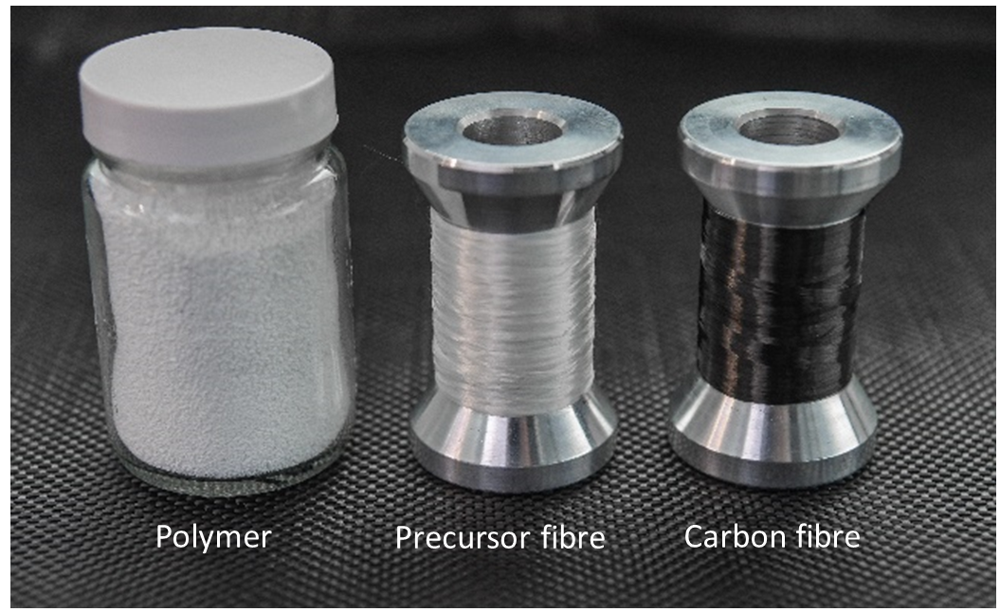

```{r setup, include=FALSE}
knitr::opts_chunk$set(
  results = 'asis',
  echo = FALSE,
  warning = FALSE,
  message = FALSE,
  fig.align = 'center'
)
knitr::opts_knit$set(root.dir = "C:/Users/kau019/Documents/Data School Focus Program/Day 3/JasjeetMarkdown/")

#Load libraries
library(tidyverse)
#library(gapminder) 
library(kableExtra)
library(readxl)
library(cowplot)
library(shiny)
Jilin_carbonisation_data_july2019 <-
read_excel("../Data/Jilin_carbonisation_July_2019JK.xlsx", sheet=1)
```


# Introduction
I am a Research Scientist in **Carbon Fibre Precursor development**. I did not know how to code prior to **Data School Focus** but was always curious to learn. My daily routine included designing and performing experiments followed by processing data and its analysis using _Origin_ and  _Microsoft Excel_. I work on a pilot scale wet spinning line which turns novel polymers into fibres and involves many predictor variables for optimisation. Large amount of data is generated from testing the fibres which makes analysis a tedious and time consuming task and a lag in feeding complete learnings of one experiment to the next.


# My Project

I am developing high quality precursors for making stronger and stiffer carbon fibres from novel polymers. Carbon fibre manufacturing consists of three steps:

- Synthesis of polymers

- Spinning of polymer solutions into precursor fibres

- Conversion of precursor fibres into carbon fibres

{width=250px}

The final carbon fibre produced is influenced by all the variables involved in the above three steps. This makes optimisation very complex. Understanding evolution of fibre characteristics at every step along the process is important. But analysis of the collected data becomes a cumbersome task. My goal through Data School Focus is to become efficient in tidying and visualising data. My project goal is to find out the processing conditions to produce **strongest and stiffest carbon fibre** and understand the influence of each treatment zone. My data was collected from 14 experiments performed on a commercial precursor using pilot scale carbon fibre production line. The fibres were collected after each treatment zone and also at the end of the processing. The predictor variables in the data were _speed, temperature, zones, tension_. The response variables in the data were _strength, stiffness, diameter, elongation_. I have only used a subset of my data for this poster. 

```{r mytable, out.width='100%', echo = T}
Tidy_table <- Jilin_carbonisation_data_july2019 %>%
 select(Experiment, Fibre, Line_speed, Zones, Diameter, Tenacity, Ini.Mod)
knitr::kable(head (Tidy_table), format = "html", caption = "Predictor and response variables in the experiments") %>% 
kable_styling("striped")
```


# Preliminary results 

Evoution of mechanical properties of the fibres were studied during conversion of precursor fibre into carbon fibre. In the first subset, 3 experiments were chosen that varied in speed of processing line. The 3 speeds were 14 (exp 1), 22 (exp 2) and 30 (exp 3) in metre/hour. It can be seen that with the change in line speed both strength and stiffness changed from Zone 1 to Zone 4 in the oxidation process and then at the carbonisation process this change is not obvious or the difference seems to be lost at the final fibre collection point.


```{r standard-plot, out.width='60%', fig.align='center', fig.height= 4, fig.width=6, fig.cap="Effect of processing speed on tenacity and diameter of oxidised fibres"}
   
# Filtering only a subset of data where line speed was changed and for only oxidation
Experiment_a <- Jilin_carbonisation_data_july2019 %>%
  filter(Experiment %in% c(1,2,3)) %>%
  filter(Zones %in% c("Zone 1","Zone 2","Zone 3", "Zone 4"))
# Converting chr into numeric and factors
Experiment_a$Zones<-as.factor(Experiment_a$Zones)
Experiment_a$Tenacity<- as.numeric(Experiment_a$Tenacity)
Experiment_a$Diameter <- as.numeric(Experiment_a$Diameter)
Experiment_a$Experiment<-as.factor(Experiment_a$Experiment)
Experiment_a$Emax <- as.numeric(Experiment_a$Emax)
Experiment_a$Ini.Modul <- as.numeric(Experiment_a$Ini.Modul)
Experiment_a$Ini.Mod <- as.numeric(Experiment_a$Ini.Mod)
# Relevel zones to get required sequence in legend
Experiment_b <- Experiment_a%>% 
  mutate(Zones=fct_relevel(Zones,"Zone 1","Zone 2","Zone 3", "Zone 4"))
# Visualisation 
Line_speed_plot1 <- ggplot(data=Experiment_b,mapping = aes(x = Diameter, y = Tenacity , colour = Experiment)) +
  geom_point(alpha = 0.7) + scale_colour_manual(values = c("red","green","purple"))  + ylab("Tenacity (cN/dtex)") + xlab("Diameter (µm)") + xlim(10,13) + facet_grid(~ Zones, scales = ("fixed")) + labs(title = "Strength of fibres during oxidation") + theme(plot.title = element_text(hjust = 0.5))  
Line_speed_plot1
```
```{r second-plot, out.width='60%', fig.align='center', fig.height= 4, fig.width=6, fig.cap="Effect of processing speed on initial modulus and diameter of oxidised fibres"}

Line_speed_plot2 <- ggplot(data=Experiment_b,mapping = aes(x = Diameter, y = Ini.Mod , colour = Experiment)) +
  geom_point(alpha = 0.7) + scale_colour_manual(values = c("red","green","purple"))  + ylab("Ini. Mod (cN/dtex)") + xlab("Diameter (µm)") + xlim(10,13) + facet_grid(~ Zones, scales = ("fixed")) + labs(title = "Stiffness of fibres during oxidation") + theme(plot.title = element_text(hjust = 0.5))  
Line_speed_plot2

```


```{r carbon-plot, out.width='60%', fig.align='center', fig.height= 4, fig.width=6, fig.cap="Effect of processing speed on tenacity and diameter of carbon fibres"}
# Filtering data for only carbonisation
Experiment_c <- Jilin_carbonisation_data_july2019 %>%
  filter(Experiment %in% c(1,2,3)) %>%
  filter(Zones %in% c("LT3","HT2", "Tow"))
#str(Experiment_c)
# Change variables from characters to numbers and factors 
Experiment_c$Zones<-as.factor(Experiment_c$Zones)
Experiment_c$Tenacity<- as.numeric(Experiment_c$Tenacity)
Experiment_c$Diameter <- as.numeric(Experiment_c$Diameter)
Experiment_c$Experiment<-as.factor(Experiment_c$Experiment)
Experiment_c$Emax <- as.numeric(Experiment_c$Emax)
Experiment_c$Ini.Modul <- as.numeric(Experiment_c$Ini.Modul)
Experiment_c$Ini.Mod <- as.numeric(Experiment_c$Ini.Mod)
#str(Experiment_c)
#Relevel zones to get the sequence of legends
Experiment_d <- Experiment_c%>% 
  mutate(Zones=fct_relevel(Zones,"LT3","HT2","Tow"))
#str(Experiment_d)
#Visualisation
Line_speed_plot3 <- ggplot(data=Experiment_d,mapping = aes(x = Diameter , y = Tenacity, colour = Experiment)) +
  geom_point(alpha = 0.5) + scale_colour_manual(values = c("red","green","purple"))  + ylab ("Tenacity (cN/dtex)") +  xlab("Diameter (µm)") + facet_grid(~ Zones, scales = ("fixed")) + labs(title = "Strength of fibres during carbonisation") + theme(plot.title = element_text(hjust = 0.5))  
Line_speed_plot3 
```


```{r third-plot, out.width='60%', fig.align='center', fig.height= 4, fig.width=6, fig.cap="Effect of processing speed on initial modulus and diameter of carbon fibres"}

Line_speed_plot4 <- ggplot(data=Experiment_d,mapping = aes(x = Diameter , y = Ini.Mod, colour = Experiment)) +
  geom_point(alpha = 0.5) + scale_colour_manual(values = c("red","green","purple"))  + ylab ("Ini.Mod (cN/dtex)") +  xlab("Diameter (µm)") + facet_grid(~ Zones, scales = ("fixed")) + labs(title = "Stiffness of fibres during carbonisation") + theme(plot.title = element_text(hjust = 0.5))  
Line_speed_plot4

```


It can be seen from the \@ref(fig:standard-plot) that although there doesn't appear to be difference in strength of final carbon fibre after carbonisation, there does appear to be difference in fibre properties when I fibre was evolving through oxidation process. This should be statistically tested in the next step.


# My Digital Toolbox

- `tidyverse` for programming
- `ggplot2`for visualisation
- `Knitr` and `KableExtra` to create this html document


## Favourite tool 

Some of my favourite functions are `str()`,`filter()`. I enjoyed using `ggplot2`

{.pull-right width=100px}


# My time went ...

I easily sailed through the lesson days and activities but I was nervous on practical days while working on my own data set, especially when I encountered problems. The helpers and instructors were extremely knowledgable and patiently solved the queries. One of the challenge in my data set was inconsistent white space.  

# Next steps

Data school has given me skills to manage my data and to be able to return to it and reuse it. I would like to polish my R skills down the track and would also like to learn Python.

# My Data School Experience

Data School Focus was a great learning experience. I enjoyed all aspects of data management including tidying, visualisation and creating a markdown document for communication. Thanks to Stephen, kerensa, Alex and all the helpers who were extremely knowledgeable. I am excited that the skills I have learnt in Data School will allow me to think about data management from the very beginning of the project. Now I have the tools like the Research Data Planner to be able to initiate discussions with my team mates on how to have a healthy data ecosystem. Thanks to the librarians for the lesson. Having learnt some R skills now, I am not scared of large datasets. The entire Data School Cohort has been so friendly. Last but not the least, big thanks to Nat for being an amazing go to person.


